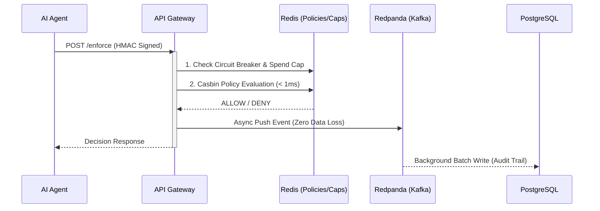

# 🛡️ SENTINEL 
**S**ecure **E**nforcement & **N**etworked **T**rust **I**nfrastructure for **N**eutralized **E**xposure in **L**ive **T**ransactions

> **The foundational safety infrastructure that makes deploying autonomous financial agents possible.**

---

## 📖 Overview
As autonomous AI agents multiply across financial services, deploying them responsibly requires strict guardrails. SENTINEL is a high-performance, real-time governance control plane designed to enforce safety, security, and financial policies across fleets of autonomous financial agents.

SENTINEL operates on the principle of **Zero-Trust** and **Fail-Closed** security, ensuring that no agent can perform unauthorized actions, exceed dynamic spend limits, or operate outside its designated scope.

---

## 🏗️ Interactive Architecture Flow

---

## ✨ Key Features (Click to expand)

⚡ Sub-Millisecond Policy Enforcement

Powered by Redis and Casbin, evaluating agent requests in <1ms. We keep the database entirely off the hot-path to prevent bottlenecks.

🔗 Cryptographic Hash-Chaining

Every audit log entry is linked to the previous one via SHA-256 hashes, creating a tamper-proof, immutable ledger of all agent activity—similar to Git commits.

🛑 Fail-Closed Circuit Breakers & Kill Switches

Distributed emergency stop controls that instantly halt a specific agent or the entire fleet. If dependencies fail, the system defaults to blocking all actions.

📈 Real-Time Anomaly Detection

Z-Score and Exponential Moving Average (EMA) algorithms instantly detect and isolate erratic agent behavior before human intervention is needed.

---

## 🛠️ Technology Stack
| Category | Tech | Why? |
|----------|------|------|
| **API / Backend** | FastAPI, `uvicorn[standard]` | Max concurrency, async by design |
| **Policy Engine** | Casbin (`pycasbin`) | Proven RBAC & ABAC authorization |
| **Event Stream** | Redpanda (`aiokafka`) | Zero data-loss audit logging |
| **Caching / State** | Redis (`hiredis`) | Atomic operations for spend caps |
| **Database** | PostgreSQL (`asyncpg`) | Immutable ledger storage |
| **Dashboard** | React, WebSockets | Real-time monitoring |
