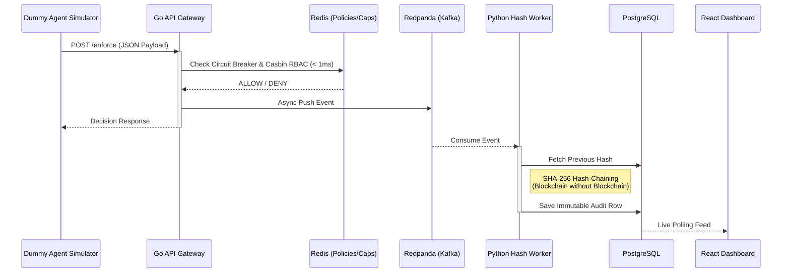

# 🛡️ SENTINEL 
**S**ecure **E**nforcement & **N**etworked **T**rust **I**nfrastructure for **N**eutralized **E**xposure in **L**ive **T**ransactions

[](#)
[](#)
[](#)
[](#)

> **The foundational safety infrastructure that makes deploying autonomous financial agents possible.**

---

## 📖 Overview
As autonomous AI agents multiply across financial services, deploying them responsibly requires strict guardrails. **SENTINEL** is a high-performance, real-time governance control plane designed to enforce safety, security, and financial policies across fleets of autonomous financial agents.

SENTINEL operates on the principle of **Zero-Trust** and **Fail-Closed** security, ensuring that no agent can perform unauthorized actions, exceed dynamic spend limits, or operate outside its designated scope.

---

## 🏗️ Interactive Polyglot Architecture Flow

We utilize a **Polyglot Microservices Architecture** to use the best tool for each specific job:
1. **Go (Golang) Gateway:** Handles raw API traffic at sub-millisecond speeds.
2. **Python Workers:** Handles complex cryptography (Hash-Chaining) and live testing.



---

## ✨ Key Technical Highlights (Click to expand)

<details>
<summary>⚡ Sub-Millisecond Go Gateway</summary>
Powered by Go (Golang) and Redis. We evaluate incoming agent requests against Casbin RBAC policies and Sliding Window spend caps in under 1ms. The heavy lifting is offloaded to Kafka so the gateway never waits.
</details>

<details>
<summary>🔗 Cryptographic Hash-Chaining (Python)</summary>
Every audit log entry is linked to the previous one via SHA-256 hashes generated by our Python worker, creating a tamper-proof, immutable ledger of all agent activity—similar to Git commits but mapped directly in PostgreSQL.
</details>

<details>
<summary>🛑 Visual React Dashboard & Kill Switch</summary>
A premium React (Vite) dark-mode dashboard that displays the live stream of Hash-Chained logs and features a massive "Emergency Stop" button that can instantly freeze the entire AI fleet.
</details>

<details>
<summary>🤖 Dummy Agent Testing Simulator</summary>
We built a dedicated Python test suite that acts as a "Rogue AI". It fires hundreds of requests at the Go Gateway to prove that the spend caps and Casbin policies hold up under live, dynamic pressure.
</details>

---

## 🛠️ Technology Stack
| Category | Tech | Why? |
|----------|------|------|
| **API Gateway** | Go (Golang) | Max concurrency, sub-millisecond latency |
| **Security Worker** | Python (`hashlib`) | Fast cryptographic processing |
| **Policy Engine** | Casbin | Proven RBAC & ABAC authorization |
| **Event Stream** | Redpanda (Kafka) | Zero data-loss asynchronous audit logging |
| **Caching / State** | Redis | Atomic operations for spend caps |
| **Database** | PostgreSQL | Immutable ledger storage |
| **Dashboard** | React (Vite) | Premium real-time monitoring and Kill Switch |

---

## 🚀 Quick Start (Running the System)

**1. Start the Infrastructure**
```bash
docker-compose up -d
```
*(Spins up Redis, Redpanda, and PostgreSQL).*

**2. Start the Python Hash Worker**
```bash
cd python_workers
pip install -r requirements.txt
python audit_worker.py
```

**3. Start the React Dashboard**
```bash
cd dashboard
npm install
npm run dev
```
