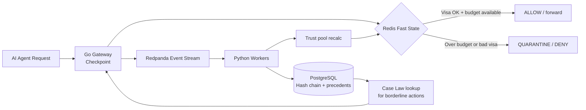

# SENTINEL — Know Your Agent (KYA) Governance Platform

[](#)
[-7c3aed)](#)
[](#)
[](#)

> **"Banks have KYC for humans. SENTINEL introduces KYA — a cryptographic Digital Passport, precedent-based Case Law, and a systemic Trust Economy for AI fleets."**

**Jump to:** [Why SENTINEL](#-why-sentinel-exists) · [Three Innovations](#-three-core-innovations) · [How It Works](#-how-a-decision-flows) · [Architecture](#-architecture) · [Quick Start](#-quick-start) · [Demo Script](#-demo-script-for-judges) · [Roadmap](#-built-today--next-up)

---

## Why SENTINEL Exists

Financial institutions are deploying autonomous AI agents to move money, resolve disputes, and act on customer data. Today's guardrails answer one question:

> *"Does this agent have permission to call this API?"*

That is not enough. A permitted agent can still hallucinate, drift, or behave dangerously **within** its limits. Static API keys and threshold-based anomaly scores do not explain *why* a decision was made — and they treat each agent in isolation, ignoring **systemic contagion** across a fleet.

SENTINEL reframes AI governance around three ideas banks already understand: **identity (passport)**, **precedent (case law)**, and **systemic risk (trust economy)**.

---

## Three Core Innovations

### 1. KYA Digital Passport — govern identity, not just requests

| Traditional guardrails | SENTINEL KYA Passport |
| :--- | :--- |
| Static API key = permanent blank check | Every agent carries a living passport (role, visa status, risk budget) |
| Audit logs are write-only archives | Every decision is **SHA-256 hash-chained** into immutable governance memory |
| Past behavior can be ignored | The passport is the agent's verifiable history — it cannot be forged or wiped |

**Visa statuses** (examples): `FULL_AUTONOMY` · `HUMAN_QUARANTINE` · `FROZEN`

---

### 2. Governance Case Law — precedents instead of thresholds

**The shift:** Stop deciding with `if anomaly_score > 0.8 → block`. Start deciding with *"what did humans do the last times this looked similar?"*

```
Old model                          SENTINEL Case Law
──────────                         ─────────────────
Raw score → threshold → block      Event → vector → k-NN over past rulings → decision + citation
"Denied: 97% anomaly"              "Approved: matches Case #4821 — human approved similar refund for repeat customer"
Audit log = passive record         Audit log = active decision input (no model retraining)
```

**How it works (concept):**

1. Every action — especially every **human override** in quarantine — is embedded as a vector: amount, time, sequence, agent, outcome, stated reason.
2. A borderline action triggers **k-nearest precedent lookup** (cosine similarity over stored vectors).
3. The system returns a decision **and** a concrete explanation built from real prior rulings.

**Why this is different:** Explainability becomes specific and auditable. The "your thresholds are arbitrary" criticism disappears — the justification is a prior human decision, not a hyperparameter.

---

### 3. Trust Economy — systemic risk, not isolated trust scores

**The shift:** Trust is not a per-agent number in a silo. It is a **shared, finite risk pool** the whole fleet draws from — like capital reserves in banking.

| Individual trust score | Trust Economy |
| :--- | :--- |
| Rogue agent quarantines itself | Rogue agent **tightens the collective budget** |
| Other agents unaffected | Similar agents (shared model, prompt, tools) see **autonomy contract** proportionally |
| "Did agent #47 act weird?" | "Is the **fleet** exposed to correlated failure?" |

**Demo moment for judges:** One misbehaving simulated agent visibly drags down the autonomy ceiling of two "innocent" agents on the dashboard — contagion made visible.

---

## How a Decision Flows



**Hot path (< 1 ms):** Gateway reads Redis — passport visa + trust pool headroom.  
**Cold path (async):** Python workers hash-chain events, update precedent vectors, recalculate fleet risk.

---

## Architecture

| Layer | Technology | Role |
| :--- | :--- | :--- |
| **Checkpoint** | Go API Gateway | Sub-ms passport + trust pool enforcement at the edge |
| **Event bus** | Redpanda (Kafka) | Zero-loss audit streaming |
| **Immigration office** | Python workers | Hash-chaining, precedent vectors, trust pool math |
| **Fast state** | Redis | Visa status, spend caps, circuit breakers |
| **Immutable ledger** | PostgreSQL (+ pgvector) | Hash-chained passport memory + precedent store |
| **Control plane** | React (Vite) dashboard | Fleet view, audit trail, emergency kill switch |
| **Policy** | Casbin | Role-based action permissions |

```text
┌─────────────┐     ┌──────────────┐     ┌─────────────────┐
│  AI Agents  │────▶│  Go Gateway  │────▶│  Banking APIs   │
└─────────────┘     └──────┬───────┘     └─────────────────┘
                           │
              ┌────────────┼────────────┐
              ▼            ▼            ▼
          ┌───────┐  ┌──────────┐  ┌──────────┐
          │ Redis │  │ Redpanda │  │  Casbin  │
          └───┬───┘  └────┬─────┘  └──────────┘
              │           │
              │     ┌─────▼─────┐
              │     │  Python   │
              │     │  Workers  │
              │     └─────┬─────┘
              │           ▼
              │     ┌─────────────┐
              └────▶│ PostgreSQL  │
                    │ audit + NN  │
                    └─────────────┘
                           │
                           ▼
                    ┌─────────────┐
                    │  Dashboard  │
                    └─────────────┘
```

---

## Built Today / Next Up

| Capability | Status | Where |
| :--- | :---: | :--- |
| Hash-chained immutable audit log | ✅ Built | `python_workers/audit_worker.py` |
| Postgres + Redis + Redpanda infra | ✅ Built | `docker-compose.yml` |
| Operator dashboard (audit + kill switch) | ✅ Built | `dashboard/` |
| Casbin RBAC policies | ✅ Scaffold | `casbin_policies/` |
| Go gateway (checkpoint) | 🔜 Planned | architecture target |
| Case Law k-NN + human override vectors | 🔜 Planned | pgvector + worker extension |
| Trust Economy pool + contagion decay | 🔜 Planned | Redis + worker + dashboard viz |

The **vision is fully specified** in [SENTINEL_ARCHITECTURAL_INSIGHTS.md](./SENTINEL_ARCHITECTURAL_INSIGHTS.md). The **prototype proves the immutable ledger and control plane**; Case Law and Trust Economy are the differentiated story and natural next layers on the same event stream.

---

## Quick Start

### Prerequisites

- Docker & Docker Compose  
- Python 3.10+  
- Node.js 18+

### 1. Start infrastructure

```bash
docker-compose up -d
```

Starts **PostgreSQL**, **Redis**, and **Redpanda**.

### 2. Run the audit worker

```bash
cd python_workers
pip install -r requirements.txt
python audit_worker.py
```

Consumes `sentinel-audit-events`, hash-chains each event into Postgres.

### 3. Launch the operator dashboard

```bash
cd dashboard
npm install
npm run dev
```

Open the URL Vite prints (typically `http://localhost:5173`). The dashboard polls for live logs and falls back to demo data until the API gateway is connected.


## Project Layout

```text
sentinel/
├── casbin_policies/          # RBAC model + policy rules
├── dashboard/                # React operator console
├── python_workers/           # Async audit + (future) case law / trust math
├── docker-compose.yml        # Postgres, Redis, Redpanda
├── presentation_draft.md     # Hackathon slide content
└── SENTINEL_ARCHITECTURAL_INSIGHTS.md
```

---


---

<p align="center">
  <strong>SENTINEL</strong> — Identity · Precedent · Systemic Trust<br/>
  <em>Governance Layer for Financial Agents</em>
</p>
